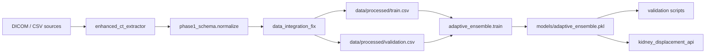

# Phase 1 Pipeline Runbook

Руководство по полному циклу: **извлечение признаков → интеграция → обучение → валидация → inference**.

Используйте этот документ как единственный источник команд для production-пайплайна Phase 1.  
Устаревшие скрипты (`prepare_dataset.py`, `train_lasso.py`, …) помечены в разделе [Legacy](#legacy).

---

## Архитектура модуля

```text
config/phase1_feature_schema.yaml          # декларативный контракт признаков
src/features/phase1_schema.py              # normalize_dataframe, BASE_FEATURES, TARGET_NAMES
src/features/pipeline.py                   # build_inference_matrix, predict_targets
scripts/run_phase1_pipeline.py             # единая CLI-точка входа

scripts/inference/enhanced_ct_extractor.py # DICOM -> canonical CSV
src/models/data_integration_fix.py         # источники -> data/processed/
models/phase1/adaptive_ensemble.py         # обучение + save models/adaptive_ensemble.pkl
scripts/validation/*                       # smoke, metrics, visuals
src/api/kidney_displacement_api.py         # FastAPI inference
```

### Поток данных



---

## Предварительные требования

Из корня репозитория (`ml trainer/`):

```bash
# Windows (PowerShell)
py -3 -m venv .venv
.\.venv\Scripts\Activate.ps1
py -3 -m pip install -r requirements.txt

# Linux / WSL
python3 -m venv .venv
source .venv/bin/activate
pip install -r requirements.txt
```

Проверка окружения:

```bash
py -3 scripts/run_phase1_pipeline.py info
# или
python3 scripts/run_phase1_pipeline.py info
```

---

## Входные данные (актуальные пути)

| Источник | Файл по умолчанию | Обязателен | Примечание |
|----------|-------------------|----------|------------|
| Vybor | `data/vybor_unified_features.csv` | **да** | основной клинический датасет с таргетами `kidney_*_delta_*` |
| DICOM metadata | `data/dicom_medical_features.csv` | нет | попадает в master; без таргетов не идёт в train |
| KiTS19 | `data/kits19_medical_grade_features.csv` | нет | подключается автоматически, если файл существует |

После интеграции:

| Артефакт | Путь |
|----------|------|
| Master | `data/integrated_master_dataset.csv` |
| Train | `data/processed/train.csv` |
| Validation | `data/processed/validation.csv` |
| Feature list | `data/processed/feature_names.json` |
| Target list | `data/processed/target_names.json` |
| Model | `models/adaptive_ensemble.pkl` |

---

## Полный цикл команд

### Вариант A — оркестратор (рекомендуется)

```bash
# 0. Справка по шагам
py -3 scripts/run_phase1_pipeline.py info

# 1. (Опционально) Извлечение признаков из DICOM
py -3 scripts/run_phase1_pipeline.py extract \
  --dicom-root /path/to/dicom_root \
  --output results/dicom_features.csv

# 2. Интеграция источников -> data/processed/
py -3 scripts/run_phase1_pipeline.py integrate

# 3. Обучение адаптивного ансамбля (~2-5 мин)
py -3 scripts/run_phase1_pipeline.py train

# 4. Валидация (smoke + метрики)
py -3 scripts/run_phase1_pipeline.py validate --run-id pipeline_$(date +%Y%m%d)

# 4b. С визуальными тестами
py -3 scripts/run_phase1_pipeline.py validate --run-id pipeline_vis_001 --visuals
```

Windows PowerShell (без `date`):

```powershell
# Режим по умолчанию: labeled_only (только Vybor + Excel, без KiTS deltas в train)
py -3 scripts/run_phase1_pipeline.py integrate
py -3 scripts/features/build_feature_reference.py
py -3 scripts/run_phase1_pipeline.py train

# Честный holdout-аудит на клинических данных (без повторного split)
py -3 scripts/run_phase1_pipeline.py validate `
  --run-id vybor_labeled_only_YYYYMMDD `
  --dataset data/processed/validation_clinical.csv `
  --holdout

# Только подмножество Vybor
py -3 scripts/run_phase1_pipeline.py validate `
  --run-id vybor_only_audit_YYYYMMDD `
  --dataset data/processed/validation_vybor_only.csv `
  --holdout --source Vybor
```

**Режимы интеграции**

| Режим | Команда | Train labels |
|-------|---------|--------------|
| `labeled_only` (default) | `integrate` или `integrate --mode labeled_only` | Vybor + уникальные строки Excel |
| `all` (legacy) | `integrate --mode all` | + KiTS19 rows с delta-колонками |

KiTS19 в `labeled_only` попадает только в `data/processed/kits19_feature_reference.csv` (медианы анатомии для imputation Excel-строк, **не** displacement targets).

### Вариант B — прямые вызовы скриптов

```bash
# 1. DICOM -> CSV (canonical schema, patient LPS mm, deltas = NaN)
py -3 scripts/inference/enhanced_ct_extractor.py /path/to/dicom_root \
  --output results/dicom_features.csv \
  --accuracy-mode balanced

# Извлечение признаков (v2):
# - координаты в patient LPS mm (ImagePositionPatient + Orientation)
# - 3D-агрегация почек по срезам (объём/длина без фиксированных +5/-5 мм)
# - TotalSegmentator: affine NIfTI, не voxel indices
# - body_width/depth на уровне почек (z-band), не по всему телу
# - kidney_*_delta_* всегда NaN (нет парной позиции)

# 2. Интеграция
py -3 src/models/data_integration_fix.py

# 3. Обучение
py -3 models/phase1/adaptive_ensemble.py

# 4a. Smoke
py -3 scripts/validation/smoke_check.py \
  --dataset data/processed/validation.csv \
  --model models/adaptive_ensemble.pkl

# 4b. Метрики
py -3 scripts/validation/evaluate_metrics.py \
  --dataset data/processed/validation.csv \
  --model models/adaptive_ensemble.pkl \
  --run-id integration_verify \
  --test-size 0.5 \
  --seed 42

# 4c. Полная WSL-валидация (visuals + metrics)
bash scripts/validation/run_all.sh wsl_run_001 all
```

Переменные для `run_all.sh`:

```bash
export DATASET_PATH="data/processed/validation.csv"
export MODEL_PATH="models/adaptive_ensemble.pkl"
export OUT_DIR="results/validation_runs"
export SEED=42
export TEST_SIZE=0.5
bash scripts/validation/run_all.sh my_run_id all
```

---

## Схема признаков (кратко)

**Контракт:** `config/phase1_feature_schema.yaml`  
**Код:** `src/features/phase1_schema.py`

| Слой | Кол-во | Примеры |
|------|--------|---------|
| Base (вход API/CSV) | 23 | `kidney_left_center_x_rel`, `body_width_mm`, `spine_center_x` |
| Engineered | 13 | `body_ratio`, `patient_position_encoded`, `volume_asymmetry` |
| Cross | 15 | `kidney_separation_angle`, `body_size_index` |
| Targets | 6 | `kidney_left_delta_x` … `kidney_right_delta_z` |

Нормализация имён из разных источников (`body_com_x_mm` → `body_com_x`, `kidney_left_vs_spine_x` → `kidney_left_center_x_rel`) выполняется в `normalize_dataframe()` **до** feature engineering.

Инжиниринг (engineered + cross) — только в `AdaptiveEnsembleTrainer` / `src/features/pipeline.py` при train и inference.

---

## Inference API

```bash
# Терминал 1
uvicorn src.api.kidney_displacement_api:app --host 127.0.0.1 --port 8000

# Терминал 2
curl -s http://127.0.0.1:8000/health
curl -s http://127.0.0.1:8000/model_info
```

Программный inference (без HTTP):

```python
from pathlib import Path
import sys
sys.path.insert(0, str(Path(".").resolve()))
sys.path.insert(0, "models/phase1")

import joblib
from adaptive_ensemble import AdaptiveEnsembleTrainer
from src.features.pipeline import predict_targets

model_data = joblib.load("models/adaptive_ensemble.pkl")
trainer = AdaptiveEnsembleTrainer()
trainer.feature_names = model_data["feature_names"]

patient = { ... }  # dict с BASE_FEATURES, см. FastAPI PatientData
predictions = predict_targets(trainer, model_data, patient)
```

---

## Артефакты валидации

После `validate` или `evaluate_metrics` / `run_all.sh`:

```text
results/validation_runs/<RUN_ID>/
  run_manifest.json
  metrics/metrics_summary.csv
  metrics/metrics_per_target.csv
  metrics/worst_cases.csv
  predictions/evaluation_predictions.csv
  plots/*.png                    # если запускались visuals
```

В `run_manifest.json` поле `predictor_mode` должно быть `pretrained_adaptive_ensemble`.  
Если видите `fallback_random_forest` — модель не загрузилась или путь к `.pkl` неверный.

---

## Тесты pytest

```bash
py -3 -m pytest tests/test_feature_schema.py tests/test_feature_pipeline.py -q
py -3 -m pytest tests/test_setup.py tests/test_simple.py -q
```

---

## Legacy

Не использовать для нового обучения / переобучения Phase 1:

| Скрипт | Причина |
|--------|---------|
| `scripts/inference/dicom_feature_extractor.py` | урезанный extractor |
| `scripts/inference/extract_from_dicom.py` | несовместимые имена колонок |
| `scripts/inference/convert_single_file.py` | Excel supine/lateral, не canonical schema |
| `src/data/prepare_dataset.py` | старый merger + свой `feature_names.json` |
| `models/phase1/train_lasso.py`, `train_ridge.py`, `target_specific_ensemble.py` | упрощённый train без полного 51-feature pipeline |
| `src/preprocessing/unified_pipeline.py` (`FeatureSchema_v1`) | AR/unpaired ветка, 36 других признаков |
| `models/phase1/api_kidney_predictor.py` | deprecated Flask API |

---

## Troubleshooting

### `FileNotFoundError: data/vybor_unified_features.csv`

Обязательный источник отсутствует. Положите файл в `data/` или укажите путь через правку `DataIntegrationFix(vybor_path=...)`.

### DICOM-строки не попадают в train

`dicom_medical_features.csv` без `kidney_*_delta_*` исключается из train/val — это ожидаемо. Для обучения нужен полный extract через `enhanced_ct_extractor.py`.

### `UnicodeEncodeError` при обучении на Windows

Обновлённый `adaptive_ensemble.py` не использует emoji в `print`. Запускайте из UTF-8 терминала или через `py -3` из PowerShell 7+.

### Метрики валидации сильно отличаются от train report

`evaluate_metrics.py` делает **дополнительный** `train_test_split` внутри переданного CSV. Для оценки на фиксированном val-сплите используйте `--test-size` согласованный с размером выборки или оценивайте напрямую на `data/processed/validation.csv` с `--test-size 0.5` (как в последнем прогоне).

### sklearn version mismatch при загрузке `.pkl`

Переобучите модель текущей версией sklearn: `py -3 scripts/run_phase1_pipeline.py train`.

---

## Связанные документы

- `docs/thesis/04_FEATURES_AND_PARAMETERS_CATALOG.md` — формулы признаков
- `docs/thesis/05_API_AND_INFERENCE_PIPELINE.md` — API-контракт
- `WSL_RUNBOOK.md` — WSL-специфичные команды validation shell-скриптов
- `docs/CODE_AUDIT_FIXES_LOG.md` — журнал исправлений схемы признаков (2.1)
