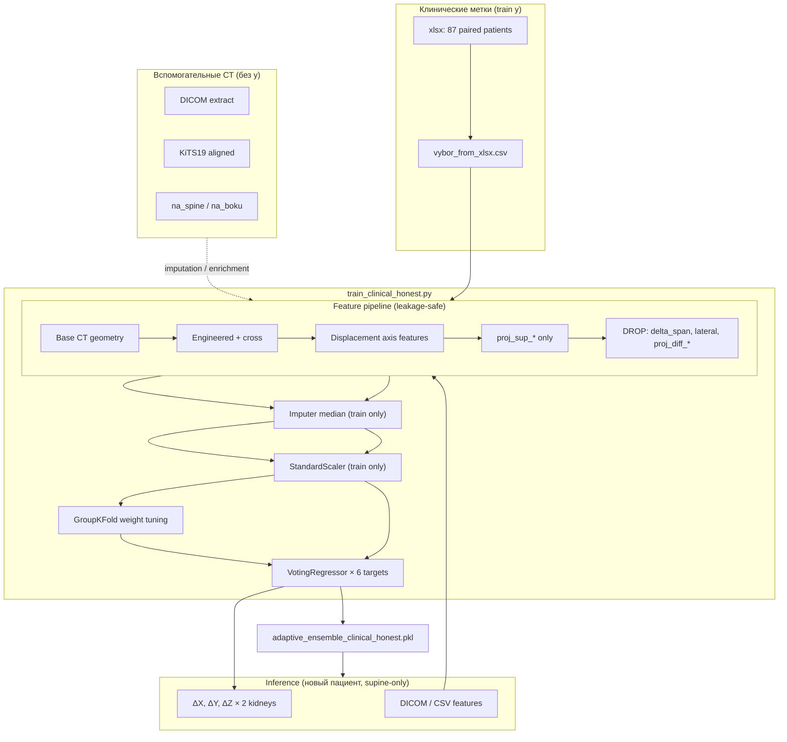
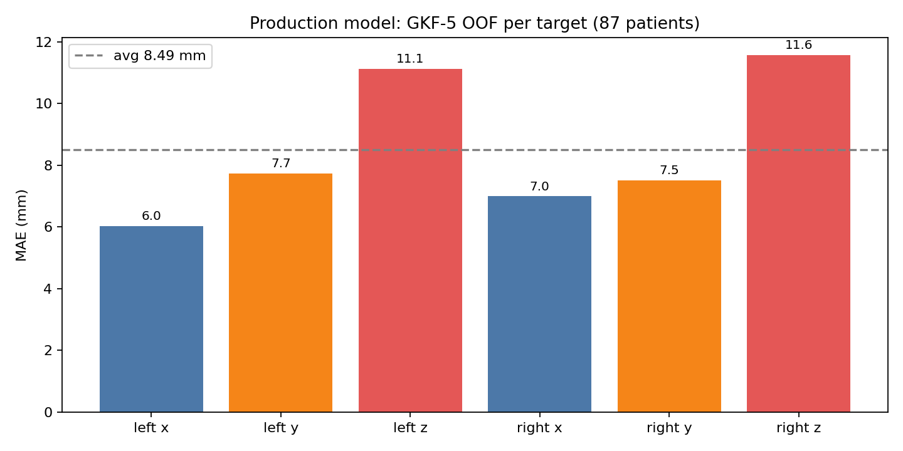

# Отчёт о production-системе предсказания смещения почек

**Дата:** 2026-06-30  
**Ветка:** `cursor/dicom-prep-pipeline`  
**Протокол оценки:** GroupKFold(5) OOF по пациенту + bootstrap CI (n=2000)

---

## 1. Резюме

Production-модель предсказывает **3D-смещение левой и правой почки** (ΔX, ΔY, ΔZ в мм) при переходе **supine CT → lateral (боковое) положение** на основе **только supine-признаков**.

| Показатель | Значение |
|------------|----------|
| **Модель** | `models/adaptive_ensemble_clinical_honest.pkl` |
| **Скрипт обучения** | `scripts/data/train_clinical_honest.py` (`--z-head ensemble`) |
| **Пациентов (метки)** | 87 (клинический xlsx) |
| **Честный avg MAE** | **8.49 mm** [7.73 – 9.31] |
| **Z avg MAE** | **11.34 mm** (узкое место) |
| **Калибраторы Z** | отключены (OOF-gate не прошли) |

Старые отчёты с MAE ~2 mm **не сопоставимы**: там были proxy-метки KiTS, утечка признаков и in-sample оценка.

---

## 2. Что используется в production

### 2.1. Артефакты

| Компонент | Путь | Назначение |
|-----------|------|------------|
| **Модель (production)** | `models/adaptive_ensemble_clinical_honest.pkl` | 6 VotingRegressor (по одному на таргет) |
| Тренер | `models/phase1/adaptive_ensemble.py` | Feature pipeline + ensemble |
| Inference API | `src/features/pipeline.py`, `scripts/validation/common.py` | Тот же FE, что при обучении |
| FastAPI (legacy default) | `src/api/kidney_displacement_api.py` | Загружает `models/adaptive_ensemble.pkl` — **не** clinical_honest |

> **Важно:** для клинически честного inference укажите `clinical_honest.pkl` в API или через `predict_df` / `load_model_bundle`.

### 2.2. Алгоритм (по осям)

Для каждого из 6 таргетов — **оптимизированный VotingRegressor** из 4 базовых моделей:

| Таргет | Базовые модели | Приоритетный single |
|--------|----------------|---------------------|
| `kidney_left_delta_x` | RF, Lasso, Ridge, GBT | RandomForest |
| `kidney_left_delta_y` | RF, Lasso, Ridge, GBT | GradientBoosting |
| `kidney_left_delta_z` | RF, Lasso, Ridge, GBT | **GradientBoosting (Huber)** |
| `kidney_right_delta_x` | RF, Lasso, Ridge, GBT | Ridge |
| `kidney_right_delta_y` | RF, Lasso, Ridge, GBT | GradientBoosting |
| `kidney_right_delta_z` | RF, Lasso, Ridge, GBT | **GradientBoosting (Huber)** |

Веса ансамбля подбираются **GroupKFold по пациентам** на train; финальный fit — на **100% клинических данных**.

### 2.3. Z-head

**Production:** `z_head = ensemble` (откат с эксперимента V7 quantile).  
Экспериментальная V7: `models/adaptive_ensemble_clinical_honest_v7.pkl` — **не production** (Z хуже на GKF-OOF).

---

## 3. Данные

### 3.1. Обучение (единственный источник меток `y`)

```
data/Смещение - конечное -12 (2).xlsx
        │
        ▼  build_vybor_from_xlsx.py
data/vybor_from_xlsx.csv   ← 87 пациентов, paired supine+lateral
```

- Метки: 6 колонок `kidney_*_delta_{x,y,z}` — измеренное смещение центра почки (мм).
- Анатомический каркас: `spine_center_*` ≠ `body_com_*` (lordosis, tilt, depth).
- Обогащение: `na_boku` volumes, клинические драйверы (BMI, lordosis, spans).

**Не используются как `y` для обучения:**

| Источник | Роль |
|----------|------|
| KiTS19 (~210) | Только CT-признаки / imputation reference |
| DICOM batch (~159) | Extraction QA, enrichment aux |
| na_spine / na_boku | OOS, imputation, PCA aux |
| Proxy/pseudo-δ | Запрещены (`strip_proxy_displacement_targets`) |

### 3.2. Внешние данные (post-training audit)

Скрипт: `scripts/validation/run_external_ct_audit.py`  
Последний прогон: `external_ct_audit_gkf_full_20260630`

| Источник | Строк | Coverage (enriched) | Inference reliable |
|----------|-------|---------------------|--------------------|
| DICOM | 159 | 78.0% | нет (<80%) |
| KiTS19 | 210 | 78.0% | нет |
| na_spine | 137 | 69.6% | нет |
| na_boku | 109 | 48.0% | нет |

---

## 4. Архитектура системы



---

## 5. Логика обучения

```mermaid
flowchart LR
    A[87 clinical rows] --> B[Feature engineering]
    B --> C{Drop all-NaN cols}
    C --> D[Imputer fit on 100% train]
    D --> E[Scaler fit on 100% train]
    E --> F[For each target T]
    F --> G[GroupKFold optimize ensemble weights]
    G --> H[Fit VotingRegressor on 100% train]
    H --> I[Save 6 models + scaler + imputer]
    I --> J[GKF-5 OOF evaluation]
    J --> K[OOF-gated Z calibrators]
    K --> L{Improve OOF?}
    L -->|No| M[calibrators = null]
    L -->|Yes| N[attach calibrators]
    M --> O[clinical_honest.pkl]
    N --> O
```



### 5.1. Правила честности (audit fixes)

1. **Только клинические метки** в `y` — без KiTS/DICOM proxy.
2. **Без утечки:** исключены `*delta_span*`, `*lateral*`, `proj_diff_*`.
3. **Imputer/scaler** fit только на train-fold (при OOF) или на полном train (финальная модель).
4. **Оценка:** GroupKFold(5) по `full_name` / `case_id`, не holdout на том же train-set.
5. **Z-калибраторы:** применяются только если улучшают OOF MAE (сейчас — нет).

### 5.2. Команда обучения

```powershell
cd "D:\ml trainer"
py -3 scripts/data/train_clinical_honest.py --z-head ensemble
```

---

## 6. Результаты

### 6.1. Production GKF-5 OOF (87 пациентов)

Источник: `results/validation_runs/clinical_honest_20260630/metrics/clinical_honest_report.json`

| Таргет | MAE (mm) |
|--------|----------|
| left ΔX | 6.03 |
| left ΔY | 7.73 |
| **left ΔZ** | **11.12** |
| right ΔX | 6.99 |
| right ΔY | 7.51 |
| **right ΔZ** | **11.56** |
| **Среднее** | **8.49** |
| **Z среднее** | **11.34** |

| Ось | MAE (mm) |
|-----|----------|
| X | 6.51 |
| Y | 7.62 |
| Z | 11.34 |

95% CI avg MAE: **7.73 – 9.31 mm**



### 6.2. Сравнение с экспериментами (тот же GKF-5 протокол)

| Вариант | Avg MAE | Z avg | Примечание |
|---------|---------|-------|------------|
| **Production ensemble** | **8.49** | **11.34** | текущий production |
| V7 quantile (prod path) | 8.72 | 12.02 | откатан |
| V7 matrix (ideal FE) | 8.17 | 11.01 | experiment_matrix |
| Legacy in-sample holdout | ~4–5 | ~5–6 | **завышенно оптимистично** |
| Март 2026 integrated | ~2.1 | ~1.8 | proxy labels + leakage |

### 6.3. Внешний аудит (GKF, без skip)

`external_ct_audit_gkf_full_20260630` — подтверждает clinical GKF **8.49 mm**, DICOM лучший aux для imputation (78% coverage).

---

## 7. 3D-демонстрация

Визуализация: supine-позиция почек + **предсказанное** lateral-смещение (облака точек).  
Скрипт: `scripts/validation/run_visual_tests.py`

```powershell
py -3 scripts/validation/run_visual_tests.py `
  --dataset data/vybor_from_xlsx.csv `
  --model models/adaptive_ensemble_clinical_honest.pkl `
  --run-id production_system_report_20260630 `
  --num-cases 3 --holdout
```

### 7.1. Один кейс — 3D вид


- **Crimson / Dodgerblue** — почки в supine  
- **Darkred / Navy** — predicted lateral (supine + Δ)  
- **Black** — позвоночник (L3)

### 7.2. Multi-panel (XY, XZ, 3D)


### 7.3. Overlay supine vs predicted


### 7.4. Пример предсказания (case `excel_1`)

| | ΔX | ΔY | ΔZ | ‖Δ‖ |
|---|-----|-----|-----|------|
| Left kidney | −2.2 | 8.9 | 2.5 | 9.5 mm |
| Right kidney | −7.5 | 0.2 | 10.7 | 13.1 mm |

Источник: `results/validation_runs/production_system_report_20260630/predictions/case_excel_1.json`

---

## 8. Объяснение результатов

### 8.1. Почему ~8.5 mm — это реалистично

1. **Мало данных:** 87 paired кейсов при 6 таргетах и ~71 признаке — высокая дисперсия.
2. **Z физически сложнее:** литература (Deshmukh 2021, PMID 34314236) показывает **асимметричное** смещение left/right, зависимость от BMI и пола; дыхательная подвижность ~12–14 mm (4D-CT).
3. **Supine-only inference:** lateral-информация недоступна на входе — потолок точности ниже, чем при полном доступе к lateral CT.
4. **Честный протокол:** GKF-OOF не даёт «подглядеть» в val — в отличие от старых holdout_eval на train-set.

### 8.2. Почему Z ≈ 11 mm (хуже X/Y)

| Фактор | Влияние |
|--------|---------|
| Высокая межпациентная вариабельность по cranio-caudal | Z-разброс больше |
| 20 projection-колонок all-NaN на клинике | теряются Z-драйверы |
| Один ensemble на обе почки | литература: left ≠ right по Z |
| n=87 | мало для стабильной Z-регрессии |

### 8.3. Что улучшит Z (без новых меток — инкремент)

1. Заполнить `proj_sup_*`, lordosis на всех 87 (enrichment)  
2. Side-specific Z heads + monotonic constraints (HistGradientBoosting)  
3. Interaction `sex×bmi`, `lordosis×depth`  
4. **Главный рычаг:** новые paired clinical CT

### 8.4. Интерпретация 3D-графиков

Графики показывают **направление и величину** предсказанного смещения в анатомической системе координат (X: L→R, Y: P→A, Z: I→S). Смещение применяется к supine-центру почки: `lateral_pos = supine_pos + Δ`. Это планировочная визуализация для лапароскопии/доступа, не сегментация CT.

---

## 9. Воспроизведение

```powershell
# 1. Сбор клинического CSV из xlsx
py -3 scripts/data/build_vybor_from_xlsx.py

# 2. Обучение production
py -3 scripts/data/train_clinical_honest.py --z-head ensemble

# 3. Внешний аудит + GKF
py -3 scripts/validation/run_external_ct_audit.py --run-id audit_rerun

# 4. Experiment matrix (сравнение вариантов)
py -3 scripts/validation/run_experiment_matrix.py

# 5. 3D визуализация
py -3 scripts/validation/run_visual_tests.py `
  --dataset data/vybor_from_xlsx.csv `
  --model models/adaptive_ensemble_clinical_honest.pkl `
  --run-id production_system_report_20260630 --num-cases 3 --holdout

# 6. График MAE для отчёта
py -3 scripts/validation/_gen_report_figure.py
```

Тесты: `py -3 -m pytest tests/test_data_integration_labeled_only.py tests/test_ct_external_enrichment.py -q`

---

## 10. Файловая карта артефактов

| Артефакт | Путь |
|----------|------|
| Production model | `models/adaptive_ensemble_clinical_honest.pkl` |
| Clinical CSV | `data/vybor_from_xlsx.csv` |
| Honest metrics | `results/validation_runs/clinical_honest_20260630/` |
| External audit | `results/validation_runs/external_ct_audit_gkf_full_20260630/` |
| Experiment matrix | `results/validation_runs/experiment_matrix_gkf5.json` |
| 3D plots (этот отчёт) | `results/validation_runs/production_system_report_20260630/plots/` |
| MAE figure | `docs/figures/production_mae_per_target.png` |

---

*Отчёт сгенерирован по состоянию репозитория на 2026-06-30. Production Z-head: ensemble.*
