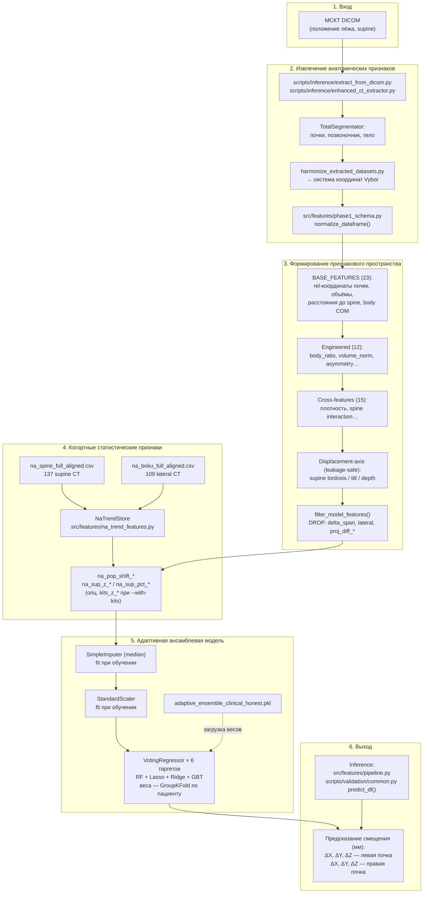
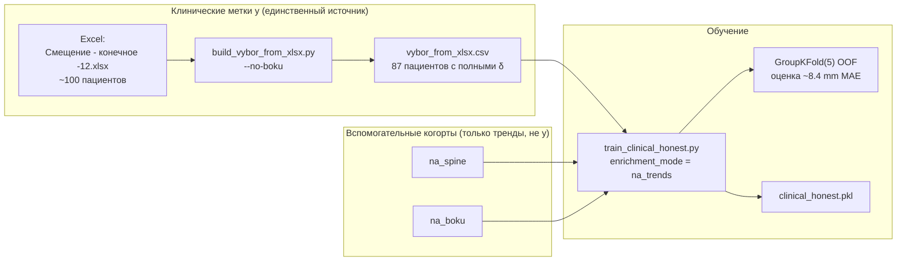
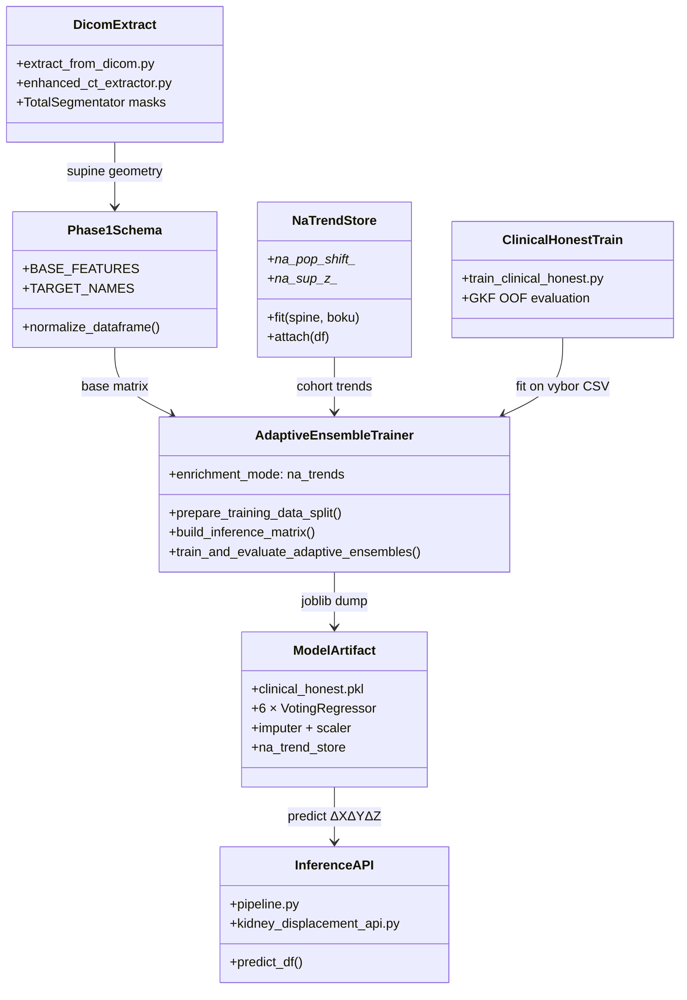

# Схема: от исследовательской модели к программной системе

**Цель подраздела:** показать, как исследовательская постановка (МСКТ supine → предсказание смещения почек при переходе в lateral) реализована в текущем production-пайплайне репозитория `ml-trainer`.

**Production-модель:** `models/adaptive_ensemble_clinical_honest.pkl`  
**Тренер:** `models/phase1/adaptive_ensemble.py`  
**Обучение:** `scripts/data/train_clinical_honest.py`

---

## 1. Поток данных (inference — новый пациент)

На входе — **только МСКТ в положении лёжа (supine)**. Lateral-скан на этапе предсказания **не требуется**.



---

## 2. Поток обучения (отдельный контур меток)

Метки смещения **не** извлекаются из DICOM inference-пайплайна — они приходят из клинической таблицы с paired supine+lateral измерениями.



---

## 3. UML: компоненты системы



---

## 4. Соответствие этапов описанию подраздела

| Этап (текст подраздела) | Реализация в системе |
|-------------------------|----------------------|
| МСКТ (положение лёжа) | DICOM supine → `extract_from_dicom.py` |
| Извлечение анатомических признаков | TotalSegmentator + `phase1_schema` + `coordinate_harmonization` |
| Формирование признакового пространства | `AdaptiveEnsembleTrainer`: BASE + engineered + cross + axis (без утечек) |
| Когортные статистические признаки | `NaTrendStore` ← `na_spine` + `na_boku` (+ опц. KiTS) |
| Адаптивная ансамблевая модель | 6 × `VotingRegressor`, веса по GroupKFold |
| Предсказание ΔX, ΔY, ΔZ | 6 скалярных таргетов → 3D-вектор на почку |

---

## 5. Что сознательно **не** входит в production-поток

| Исключено | Причина |
|-----------|---------|
| KiTS19 / DICOM в таргетах `y` | proxy-метки, не клиническая истина |
| `proj_lat_*` join по ФИО | подмена per-patient lateral-координат |
| `proj_diff_*`, `delta_span`, `lateral` | утечка lateral-информации |
| Holdout-18 как главная метрика | optimistic при full-train |
| `adaptive_ensemble.pkl` (legacy API) | старая модель без honest-пайплайна |

---

## 6. Команды

```powershell
# Обучение production
py -3 scripts/data/build_vybor_from_xlsx.py --no-boku
py -3 scripts/data/train_clinical_honest.py --z-head ensemble

# Inference (тот же FE, что при обучении)
# predict_df(bundle, supine_features_df)  →  6 колонок delta_*
```

См. также: [`DATA_ARCHITECTURE.md`](DATA_ARCHITECTURE.md), [`CLINICAL_VALIDATION_RUN_REPORT_20260630.md`](CLINICAL_VALIDATION_RUN_REPORT_20260630.md).
