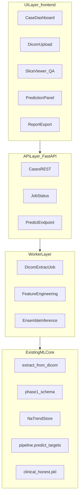

# CT Workbench — архитектура системы

Документ описывает целевую архитектуру браузерного интерфейса для анализа supine-МСКТ и ML-прогноза смещения почек. Связанные документы: [PRD.md](PRD.md), [FEATURES_AND_SCENARIOS.md](FEATURES_AND_SCENARIOS.md).

---

## 1. Назначение и границы системы

### 1.1. Что делает CT Workbench

CT Workbench — локальная рабочая станция в браузере для клинико-исследовательского контура:

1. **Загрузка** DICOM исследования в положении **лёжа (supine)**.
2. **Автоматическое извлечение** анатомических признаков (почки, позвоночник, тело).
3. **QA (ручная проверка)** критичных полей при необходимости.
4. **ML-прогноз** смещения почек при переходе в lateral: 6 значений ΔX, ΔY, ΔZ (левая и правая почка).
5. **Экспорт** результата (JSON/PDF) для отчёта или внешней AR-навигации.

Lateral-скан на этапе inference **не требуется** — модель обучена предсказывать смещение только по supine-анатомии и когортным трендам.

### 1.2. Что система не делает (MVP и v1.1)

| Исключено | Причина |
|-----------|---------|
| Полноценный PACS / RIS | Вне scope; только загрузка файлов |
| Облачное хранение PHI | Локальное хранение на рабочей станции |
| Интраоперационная навигация | Только экспорт данных; HoloLens/Unity — отдельный контур |
| Автоматическая калибровка на lateral-КТ | Модель не использует lateral на inference |
| Замена клинического протокола | Инструмент исследовательский; дисклеймер в отчёте |

---

## 2. Контекст в текущем репозитории

CT Workbench **не дублирует** ML-пайплайн, а оркестрирует уже существующие модули.

### 2.1. Карта интеграции

| Этап | Модуль | Путь |
|------|--------|------|
| DICOM → NIfTI + сегментация | `extract_from_dicom.py` | `scripts/inference/extract_from_dicom.py` |
| Выбор серии, dcm2niix | `dicom_prep.py` | `scripts/inference/dicom_prep.py` |
| Геометрия тела | `enhanced_ct_extractor.py` | `scripts/inference/enhanced_ct_extractor.py` |
| Каноническая схема признаков | `phase1_schema` | `src/features/phase1_schema.py` |
| Axis/anatomical features | `displacement_axis_features` | `src/features/displacement_axis_features.py` |
| Когортные тренды | `NaTrendStore` | `src/features/na_trend_features.py` |
| Единый inference | `pipeline.predict_targets` | `src/features/pipeline.py` |
| Ансамбль | `AdaptiveEnsembleTrainer` | `models/phase1/adaptive_ensemble.py` |
| Production-модель | `clinical_honest.pkl` | `models/adaptive_ensemble_clinical_honest.pkl` |
| Обучение honest | CLI | `scripts/data/train_clinical_honest.py` |
| Валидация / predict_df | common | `scripts/validation/common.py` |

Подробная схема потока данных: [docs/SYSTEM_DATA_FLOW_SCHEME.md](../../docs/SYSTEM_DATA_FLOW_SCHEME.md).

### 2.2. Текущий API и пробелы

Существующий сервис: [src/api/kidney_displacement_api.py](../../src/api/kidney_displacement_api.py).

| Аспект | Текущее состояние | Что нужно для UI |
|--------|-------------------|------------------|
| Модель | Загружает `adaptive_ensemble.pkl` (legacy) | Переключить на `adaptive_ensemble_clinical_honest.pkl` + `na_trends` |
| Вход | ~23 числовых поля `PatientData` | + upload DICOM, async jobs |
| CORS | Не настроен | Включить для браузера |
| DICOM | Только CLI | REST + worker |
| Статус задач | Нет | Job queue + polling/WebSocket |
| Отчёты | Только JSON predict | report.json / report.pdf |

Документация API: [docs/thesis/05_API_AND_INFERENCE_PIPELINE.md](../../docs/thesis/05_API_AND_INFERENCE_PIPELINE.md).

---

## 3. Целевая архитектура (логические слои)



### 3.1. Принципы

- **Один inference-путь:** все предсказания через `src/features/pipeline.py` — без дублирования feature engineering в UI.
- **Async для тяжёлых задач:** DICOM + TotalSegmentator — минуты на кейс; не блокировать HTTP.
- **Case-centric storage:** один кейс = одна папка с DICOM, признаками, правками, прогнозом.
- **Audit trail:** любая ручная правка признаков логируется с timestamp и автором (локальный user id).

---

## 4. Компоненты и ответственность

| Компонент | Ответственность | Статус |
|-----------|-----------------|--------|
| `frontend/` | UI: dashboard, upload, viewer, формы, отчёты | **Новый** (пока только docs) |
| `src/api/cases/` | REST: кейсы, upload, analyze, predict, report | **Новый** (после docs) |
| `src/api/kidney_displacement_api.py` | Legacy predict по готовым признакам | Есть, требует обновления модели |
| Worker (RQ/Celery/subprocess) | Долгие DICOM-задачи, прогресс | **Новый** |
| `src/features/pipeline.py` | normalize → engineer → impute → predict | Есть |
| `NaTrendStore` | Когортные `na_pop_shift_*`, `na_sup_z_*`, `na_sup_pct_*` | Есть |
| Redis / FS job store | Очередь и статусы задач | **Новый** |
| `data/cases/{case_id}/` | Хранение артефактов кейса | **Новый** |

---

## 5. Жизненный цикл кейса (case lifecycle)

### 5.1. Статусы

```text
created → uploaded → extracting → features_ready → qa_pending → predicted → reported
                                                      ↓
                                                   failed
```

| Статус | Описание |
|--------|----------|
| `created` | Запись кейса создана, DICOM ещё не загружен |
| `uploaded` | DICOM сохранён на диск |
| `extracting` | Worker выполняет dcm2niix + сегментацию + feature extract |
| `features_ready` | `features.json` заполнен, можно открыть QA |
| `qa_pending` | Пользователь просматривает/правит признаки |
| `predicted` | ML-прогноз выполнен, `prediction.json` сохранён |
| `reported` | Сформирован отчёт (JSON/PDF) |
| `failed` | Ошибка на любом этапе; `error.json` с деталями |

### 5.2. Структура хранения кейса

```text
data/cases/{case_id}/
  meta.json              # id, created_at, status, patient_label (обезличенно)
  dicom/                 # исходные DICOM (или распакованный zip)
  artifacts/
    features.json        # 111 production-признаков + coverage
    base_features.json   # 23 BASE_FEATURES (auto + manual)
    manual_overrides.json # журнал ручных правок
    prediction.json      # 6 таргетов + metadata
    report.json
    report.pdf           # v2
  logs/
    extraction.log
    predict.log
```

`case_id` — UUID v4. PHI не хранить в имени папки; опциональный `patient_label` только в `meta.json`.

---

## 6. API-контракт (целевой)

Базовый URL: `http://localhost:8000/api/v1`. CORS: разрешить origin UI (localhost dev + production host).

### 6.1. `POST /cases`

Создать пустой кейс.

**Request:** `{ "patient_label": "optional string" }`  
**Response:** `{ "case_id": "uuid", "status": "created" }`

### 6.2. `POST /cases/{case_id}/upload`

Загрузить DICOM (multipart: `file` = zip или `files[]`).

**Response:** `{ "case_id", "status": "uploaded", "series_count": N }`  
**Errors:** `400` — невалидный архив; `413` — слишком большой файл.

### 6.3. `POST /cases/{case_id}/analyze`

Запустить async extraction job.

**Response:** `{ "job_id": "uuid", "status": "extracting" }`  
**Timeout:** немедленный ответ; работа в worker.

### 6.4. `GET /cases/{case_id}/status`

**Response:**

```json
{
  "case_id": "uuid",
  "status": "extracting",
  "progress_pct": 45,
  "stage": "segmentation",
  "message": "TotalSegmentator kidney_left",
  "error": null
}
```

### 6.5. `GET /cases/{case_id}/features`

**Response:**

```json
{
  "base_features": { "kidney_left_center_x_rel": 12.3, "...": "..." },
  "all_features": { "...": 111 keys },
  "coverage_pct": 94.5,
  "missing_features": ["lumbar_lordosis_deg"],
  "manual_overrides": []
}
```

### 6.6. `PATCH /cases/{case_id}/features/manual`

Частичное обновление BASE_FEATURES (ручная правка).

**Request:** `{ "overrides": { "kidney_left_center_x_rel": 13.1 }, "reason": "manual correction on slice" }`  
**Response:** пересчитанные `base_features`, новый `coverage_pct`, запись в `manual_overrides.json`.

После PATCH система **пересчитывает** engineered/cross/axis/na_trends (server-side), не принимая их из UI.

### 6.7. `POST /cases/{case_id}/predict`

**Response:**

```json
{
  "predictions": {
    "kidney_left_delta_x": 6.2,
    "kidney_left_delta_y": 7.1,
    "kidney_left_delta_z": 11.0,
    "kidney_right_delta_x": 5.8,
    "kidney_right_delta_y": 6.9,
    "kidney_right_delta_z": 10.5
  },
  "model_id": "adaptive_ensemble_clinical_honest",
  "enrichment_mode": "na_trends",
  "feature_count": 111
}
```

### 6.8. `GET /cases/{case_id}/report.json` | `report.pdf`

Агрегированный отчёт: метаданные кейса, признаки, прогноз, дисклеймер, список ручных правок.

### 6.9. `GET /cases`

Список кейсов для Dashboard (пагинация, фильтр по status).

---

## 7. Модель признаков для UI

### 7.1. Три уровня

| Уровень | Количество | Редактируемость в UI | Источник |
|---------|------------|----------------------|----------|
| BASE_FEATURES | 23 | **Да** (QA-форма) | DICOM extract + ручной ввод |
| Производные (engineered, cross, axis, anatomy) | ~40 | **Нет** (read-only) | Server-side после BASE |
| na_trends | 48 | **Нет** | `NaTrendStore` (na_spine + na_boku) |
| **Итого production** | **111** | — | `adaptive_ensemble_clinical_honest.pkl` |

### 7.2. Приоритет ручного ввода (17 полей «быстрого QA»)

См. детали в [FEATURES_AND_SCENARIOS.md](FEATURES_AND_SCENARIOS.md) (F-005, F-006):

1. 6× `kidney_*_center_*_rel`
2. 3× `spine_center_*`
3. 3× `body_com_*`
4. 3× `body_width_mm`, `body_depth_mm`, `body_area_mm2`
5. 2× `kidney_*_volume_cm3`

Расширенные (опционально): lordosis, abd wall, spans, middle points.

### 7.3. Когортные тренды

`NaTrendStore.fit()` вызывается **один раз при старте API/worker** из:

- `data/harmonized/na_spine_full_aligned.csv`
- `data/harmonized/na_boku_full_aligned.csv`

UI не загружает эти CSV; только отображает факт применения трендов в metadata прогноза.

---

## 8. Нефункциональные требования (NFR)

| ID | Требование | Целевое значение |
|----|------------|------------------|
| NFR-001 | Время ответа predict (после features_ready) | < 2 с |
| NFR-002 | Extraction на 1 кейс | async, 2–15 мин (зависит от GPU) |
| NFR-003 | CORS | Настроен для UI origin |
| NFR-004 | Хранение данных | Локально, без облака по умолчанию |
| NFR-005 | Audit trail ручных правок | 100% правок в `manual_overrides.json` |
| NFR-006 | Воспроизводимость | Один `pipeline.py` для train и infer |
| NFR-007 | Дисклеймер | В каждом отчёте: исследовательский инструмент |
| NFR-008 | Паритет признаков | UI coverage ≥ 90% BASE перед predict (warning) |

---

## 9. Фичи к реализации (roadmap)

Полные описания — в [FEATURES_AND_SCENARIOS.md](FEATURES_AND_SCENARIOS.md).

| ID | Фаза | Фича | Зависимости |
|----|------|------|-------------|
| F-001 | MVP | Загрузка DICOM (zip/folder) | `POST /cases/{id}/upload` |
| F-002 | MVP | Автовыбор серии abdomen supine | `dicom_prep.py` |
| F-003 | MVP | Async extraction job + progress | Worker, `GET /status` |
| F-004 | MVP | Автозаполнение 23 BASE_FEATURES | `extract_from_dicom` |
| F-005 | MVP | QA-форма 17 ключевых полей | `PATCH /features/manual` |
| F-006 | MVP | Predict 6 таргетов (мм) | `pipeline` + `clinical_honest.pkl` |
| F-007 | MVP | JSON-отчёт | `GET /report.json` |
| F-008 | v1.1 | DICOM viewer + оверлеи масок | Frontend stack TBD |
| F-009 | v1.1 | Coverage 111 признаков (%) | `validate_base_features` |
| F-010 | v1.1 | Сравнение до/после ручной правки | Две версии prediction |
| F-011 | v1.1 | Dashboard списка кейсов | `GET /cases` |
| F-012 | v2 | PDF-отчёт | Report generator |
| F-013 | v2 | Экспорт JSON для AR | `ENHANCED_JSON_CONTRACT` |
| F-014 | v2 | Batch-обработка когорты | Очередь N кейсов |
| F-015 | v2 | Режим исследователя (proxy vs honest) | Отдельные model bundles |

---

## 10. Риски и митигации

| Риск | Вероятность | Влияние | Митигация |
|------|-------------|---------|-----------|
| `.pkl` не в git | Высокая | API не стартует | Документировать `train_clinical_honest.py`; проверка при `/health` |
| Долгая сегментация | Высокая | Плохой UX | Async jobs + progress bar |
| Ошибки TotalSegmentator | Средняя | Пустые признаки | QA-экран + ручной ввод |
| Legacy API / wrong model | Средняя | Неверный прогноз | Единый Cases API + `clinical_honest.pkl` |
| Расхождение train/infer features | Низкая | Сдвиг метрик | Только `build_inference_matrix` + `pipeline.py` |
| PHI в логах | Средняя | Compliance | Обезличенные case_id; без ФИО в путях |

---

## 11. План реализации по этапам

| Этап | Содержание | Артефакты |
|------|------------|-----------|
| **1 (текущий)** | Спецификация | `frontend/docs/*` |
| **2** | Cases API + worker + storage | `src/api/cases/`, `data/cases/` |
| **3** | UI MVP (без viewer) | `frontend/src/` — upload, form, predict |
| **4** | Viewer + PDF + batch | Cornerstone3D, report service |

---

## 12. Связанные документы

- [PRD.md](PRD.md) — требования продукта
- [FEATURES_AND_SCENARIOS.md](FEATURES_AND_SCENARIOS.md) — фичи и сценарии
- [docs/SYSTEM_DATA_FLOW_SCHEME.md](../../docs/SYSTEM_DATA_FLOW_SCHEME.md) — ML data flow
- [docs/NA_TRENDS_PRODUCTION_REPORT.md](../../docs/NA_TRENDS_PRODUCTION_REPORT.md) — production-модель
- [docs/thesis/05_API_AND_INFERENCE_PIPELINE.md](../../docs/thesis/05_API_AND_INFERENCE_PIPELINE.md) — inference API
- [docs/ENHANCED_JSON_CONTRACT.md](../../docs/ENHANCED_JSON_CONTRACT.md) — формат богатого JSON
